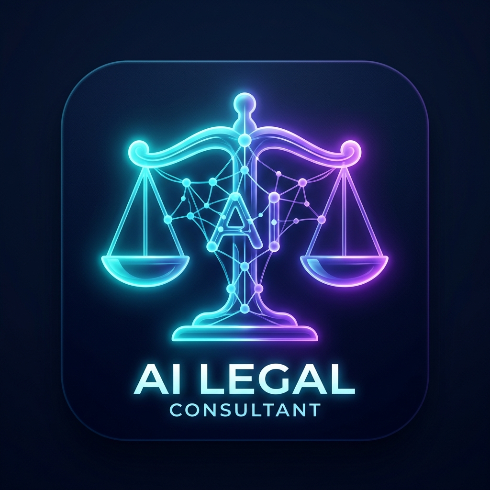

# ⚖️ AI Legal Consultant

A production-quality Python full-stack application built with **Streamlit**, **Groq API**, **Pydantic**, and **Rich**. AI Legal Consultant provides structured general legal information, contract document summarization, concept explanations, and actionable next steps with a dark glassmorphism UI.



---

## 🌟 Key Features

- **3 Operational Modes**:
  1. **❓ Ask Legal Question**: Get structured insights on tenant rights, consumer protection, employment disputes, and contracts.
  2. **📚 Explain Legal Concept**: Simplified breakdowns of legal terms (e.g., NDA, Power of Attorney, Arbitration, FIR).
  3. **📄 Summarize Legal Document**: Paste contracts to extract Parties involved, Important clauses, Risks, Obligations, and Deadlines.
- **Strict JSON Enforcement**: Enforces Pydantic schema validation for consistent response structure.
- **Modern Dark Glassmorphism UI**: Custom CSS tokens (`#0B1120`), blue/purple/cyan glowing accents, slide-up keyframes, shimmer loading bars, and cards with colored left borders.
- **Out-of-the-Box Mock Engine**: Runs out-of-the-box even without a Groq API key using the built-in mock legal engine.
- **Report Exporters**: 1-click download of analysis as Markdown reports or raw JSON schemas.
- **Pre-Loaded Sample Documents**: Built-in samples for Non-Disclosure Agreements, Commercial Leases, and Employment Contracts.

---

## 🏗️ Tech Stack

- **Python**: 3.11+
- **LLM Engine**: Groq SDK (`llama-3.3-70b-versatile`)
- **Web UI**: Streamlit
- **Validation**: Pydantic v2
- **Logging**: Rich
- **Configuration**: python-dotenv

---

## 📁 Project Structure

```
AI-Legal-Consultant/
│── app.py                   # Main Streamlit application entrypoint
│── llm.py                   # Groq API client & mock fallback service
│── prompts.py               # System & user prompt templates
│── parser.py                # Pydantic LegalResponse schema & JSON repair
│── config.py                # App configuration, paths & color tokens
│── utils.py                 # Exporters, markdown formatters & document loaders
│── requirements.txt         # Project dependencies
│── README.md                # Documentation & setup instructions
│── .env                     # Environment variables
│── .env.example             # Example environment setup
│
├── .streamlit/
│     └── config.toml        # Streamlit dark theme configuration
│
├── assets/
│     └── logo.png           # AI Legal Consultant logo asset
│
├── components/
│     ├── sidebar.py         # Sidebar navigation & API settings
│     ├── cards.py           # Glassmorphism response card components
│     └── animations.py      # CSS keyframes & design system styles
│
└── sample_documents/
      ├── nda_agreement.txt
      ├── commercial_lease.txt
      └── employment_contract.txt
```

---

## 🚀 Quick Start & Installation

### 1. Clone or Download Repository
Navigate to the root directory of the application:
```bash
cd "AI Legal Consultant"
```

### 2. Install Dependencies
```bash
pip install -r requirements.txt
```

### 3. (Optional) Configure Groq API Key
Copy `.env.example` to `.env` and add your Groq API key (get one from [Groq Console](https://console.groq.com/)):
```env
GROQ_API_KEY=gsk_your_actual_groq_api_key_here
GROQ_MODEL=llama-3.3-70b-versatile
```
*Note: If no API key is provided, the application will automatically run using its built-in Mock Legal Engine.*

### 4. Launch Application
```bash
streamlit run app.py
```

---

## 📢 Legal Disclaimer

This application provides general legal information only and is not a substitute for professional legal advice. Users must consult a qualified attorney for specific legal guidance tailored to their jurisdiction.
